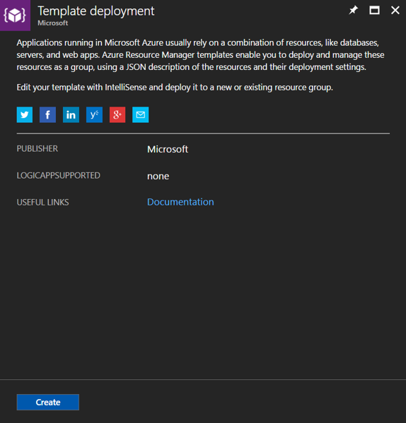
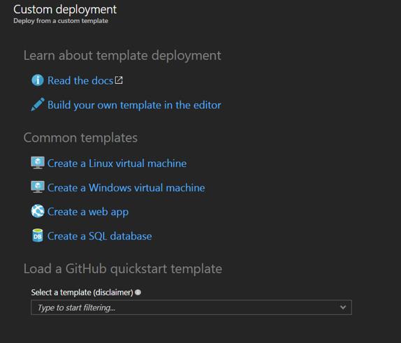
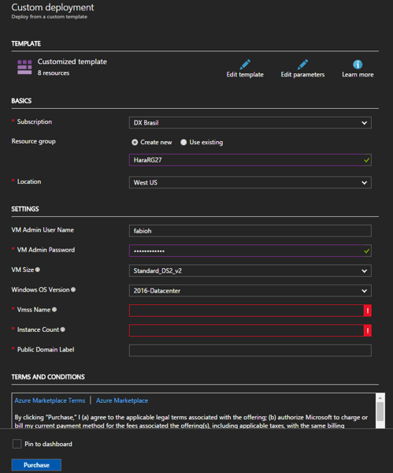
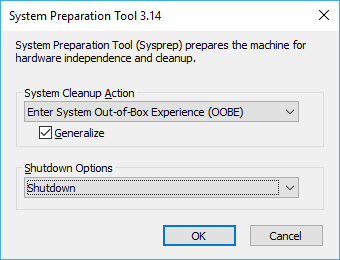
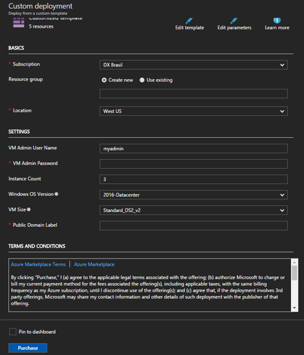

# Deploy Virtual Machine Scale Set using custom Windows Server images with Managed Disks

This guide will help you to deploy the VMSS using a customized image (based on Windows Server). Also this document use Managed Disks. 

If you want to deploy Virtual Machine Scale Set using Linux with Managed Disks just follow the blog from [(Vincent-Philippe Lauzon)](https://vincentlauzon.com/2017/02/23/creating-an-image-with-2-managed-disks-for-vm-scale-set/) .Most part of these templates and procedures described here came from his blog.  Thanks Vincent!

Also I would like to thanks [(Marcelo Matias)](https://twitter.com/marcelo_matias) for the collaboration and the review of my scripts. Yes, Matias is "the guy" of Azure and my scripts are not so "elegant". Thanks Matias!

## Requirements ##

- Azure account [(get started for free)](https://azure.microsoft.com/en-us/free/)
- Azure CLI 2.0 installed [(click here to install)](https://docs.microsoft.com/en-us/cli/azure/install-azure-cli)
- Updated version of Azure PowerShell [(more information here)](https://docs.microsoft.com/en-us/powershell/azure/install-azurerm-ps?view=azurermps-4.1.0)


## Important Notes ##

### Use the same Resource Group ###
During the deployment of the template you will need to use the same Resource Group. This is because the second template to deploy VMSS cannot load an image located on another Resource Group. To be fixed later. 


## Deploy the base image ##

Click the button bellow to deploy the first template 

<a href="https://portal.azure.com/#create/Microsoft.Template/uri/https%3A%2F%2Fraw.githubusercontent.com%2Ffabioharams%2FVMSS-Custom-Windows-Managed-Disk%2F201-vmss-win-managed.json" target="_blank">
    
</a>
<a href="http://armviz.io/#/?load=https%3A%2F%2Fraw.githubusercontent.com%2Ffabioharams%2FVMSS-Custom-Windows-Managed-Disk%2F201-vmss-win-managed.json" target="_blank">
    
</a>


If you want to manually deploy this template just follow the procedures bellow

- Open the [(Azure Portal)](https://portal.azure.com)
- Click New and select Template Deployment
- Select Template Deployment and click Create



- Copy the entire content of the template 201-vmss-win-managed.json and click SAVE



- Fill the form and then click PURCHASE. The deployment will start and you just need to wait few minutes. 
- After the deployment finish then connect via RDP and start to customize your application

### Important Notes ###
- This template deploy 1 virtual machine with a data disk (32GB). If you want to use this disk then you need to configure this disk first (this template will not format and mount this volume - you need to do this manually). If you not mount and format this volume the script will not join this disk as part of the image.


## Customize your image ##

- Prepare your image to be generalized with Sysprep. Remember that this virtual machine will not be available after the process bellow. 
- Open the directory bellow and execute Sysprep.exe

```
c:\windows\system32\sysprep\sysprep.etc
```
<ol>
Select the following options:
<li>Enter System Out-of-Box Experience (OOBE)</li>
<li>Generalize</li>
<li>Shutdown</li>
</ol>



### Important Notes ###
- Some Server Roles are not supported by Sysprep. Read this link before execute - [(Sysprep Support for Server Roles)](https://docs.microsoft.com/en-us/windows-hardware/manufacture/desktop/sysprep-support-for-server-roles)


## Clone and create the image ##

After the execution of Sysprep just wait few minutes and then open PowerShell (Run as Administrator)

### Important Notes ###
- The commands bellow came from this documentation - [(Create a managed image of a generalized VM in Azure)](https://docs.microsoft.com/en-us/azure/virtual-machines/windows/capture-image-resource)


Execute the following commands to prepare your image:

- Declare the variables
```
$vmName = "Demo-VM" 
$rgName = "HaraRG26" 
$location = "WestUS" 
$imageName = "myImage"

```

- Ensure the VM is already stopped
``` 
Stop-AzureRmVM -ResourceGroupName $rgName -Name $vmName -Force
```

- Generalize the VM
```
Set-AzureRmVm -ResourceGroupName $rgName -Name $vmName -Generalized
```

- Declare more variables
```
$vm = Get-AzureRmVM -Name $vmName -ResourceGroupName $rgName

$image = New-AzureRmImageConfig -Location $location -SourceVirtualMachineId $vm.ID
```

- Create the image
```
New-AzureRmImage -Image $image -ImageName $imageName -ResourceGroupName $rgName
```

## Remove unnecessary itens ##

In order to install a Scale Set in the same availability set, we need to remove the VM and other unnecessary objects.

Open PowerShell (run as Administrator) and execute these commands:

```
Remove-AzureRmVM -ResourceGroupName $rgName -Name $vm.Name -Force
Remove-AzureRmNetworkInterface -ResourceGroupName $rgName -Name frontNic -Force
Remove-AzureRmAvailabilitySet -ResourceGroupName $rgName -Name frontAvailSet -Force
```

Optionally you can remove the disks

```
Remove-AzureRmDisk -ResourceGroupName $rgName -DiskName Demo-VM -Force
Remove-AzureRmDisk -ResourceGroupName $rgName -DiskName Demo-VM-data -Force
Remove-AzureRmLoadBalancer -ResourceGroupName $rgName -Name PublicLB -Force
```

Now you are ready to deploy the VMSS using this image. Also you can use this image to deploy a single VM. 

## Deploy the Virtual Machine Scale Set ##

Click the button bellow to deploy the second template 

<a href="https://portal.azure.com/#create/Microsoft.Template/uri/https%3A%2F%2Fraw.githubusercontent.com%2Ffabioharams%2FVMSS-Custom-Windows-Managed-Disk%2F202-vmss-win-managed.json" target="_blank">
    
</a>
<a href="http://armviz.io/#/?load=https%3A%2F%2Fraw.githubusercontent.com%2Ffabioharams%2FVMSS-Custom-Windows-Managed-Disk%2F202-vmss-win-managed.json" target="_blank">
    
</a>


If you want to manually deploy this template just follow the procedures bellow


- Open the [(Azure Portal)](https://portal.azure.com)
- Click New and select Template Deployment
- Select Template Deployment and click Create


- Copy the entire content of the template 202-vmss-win-managed.json and click SAVE



- Fill the form and then click PURCHASE. The deployment will start and you just need to wait few minutes. 

### Use the same Resource Group ###
During the deployment of the template you will need to use the same Resource Group. This is because the second template to deploy VMSS cannot load an image located on another Resource Group. To be fixed later. 


After the deploy finish the execution process you can access your Resource Group and check all objects created
